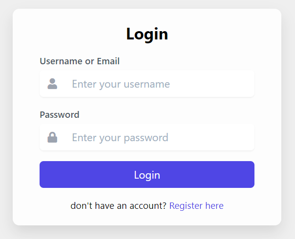
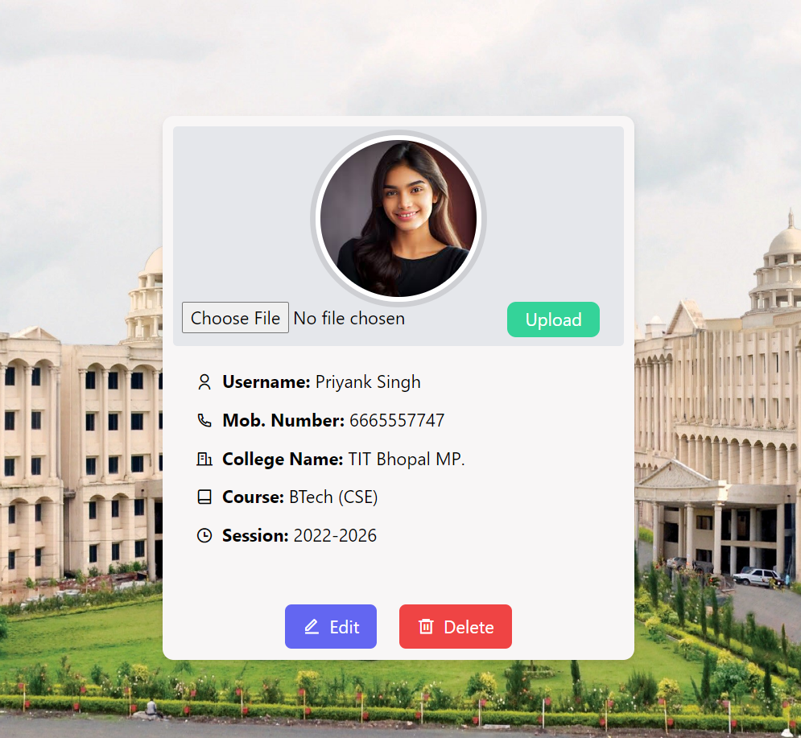
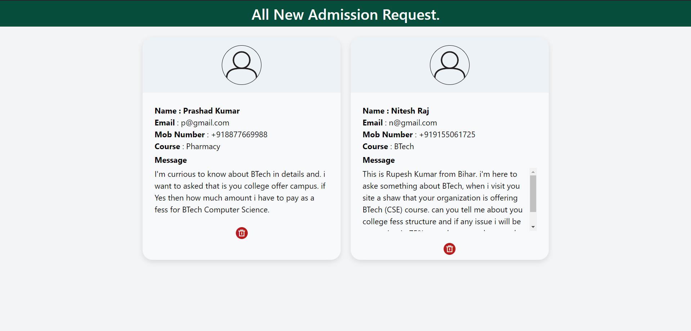

# Student Management System 

The Student Management System is a web application designed to streamline administrative tasks and enhance user experience for both students and administrators. It provides features for student registration, profile management, admission requests, and administrative control over user data and admission requests.

## Features

1. **User Registration**: Students can register with the system using their personal details.
2. **Profile Management**: Users can view and edit their profile information, ensuring up-to-date records.
3. **Admission Requests**: Students can submit admission requests through the system.
4. **Authentication and Authorization**: Passport.js is utilized for user authentication and authorization, ensuring secure access to the system's functionalities.
5. **Admin Panel**: Administrators have access to manage user data and admission requests.
   - **View User Profiles**: Admins can see the details of registered users.
   - **Edit User Details**: Admins can modify user information as needed.
   - **Delete Users**: Admins have the authority to delete user accounts.
   - **View Admission Requests**: Admins can review all admission requests submitted by students.
   - **Delete Admission Requests**: Admins can delete admission requests as necessary.

## Technologies Used

- **Development Tools**:
  - Visual Studio Code
  - GitHub and Git for version control

- **Frontend**:
  - EJS (Embedded JavaScript) for templating
  - JavaScript for client-side scripting

- **Backend**:
  - Node.js for server-side logic
  - Express.js for building web applications
  - MongoDB for database management
  - Passport.js for authentication and authorization

## Getting Started

To get a local copy up and running, follow these steps:

1. Clone the repository from GitHub.
2. Install dependencies using `npm install`.
3. Set up MongoDB database.
4. Configure Passport.js for authentication and authorization.
5. Run the application using `npm run dev`.
6. Access the application through the specified port in the browser.

## Screenshots

1. **Registration Page**  
   

2. **Login Page**  
   
3. **Admin Dashboard**  
   .png)

4. **Profile Details Update Page**  
   

5. **Admission Request Page**  
   
## Future Improvements

- Enhance authentication with additional strategies (e.g., OAuth).
- Implement role-based access control for finer-grained authorization.
- Improve error handling and validation for a more robust system.

## License

This project is licensed under the [MIT License](https://opensource.org/licenses/MIT).
